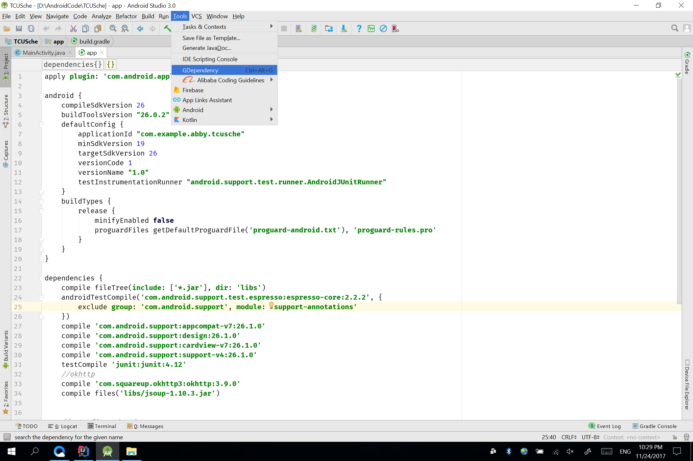
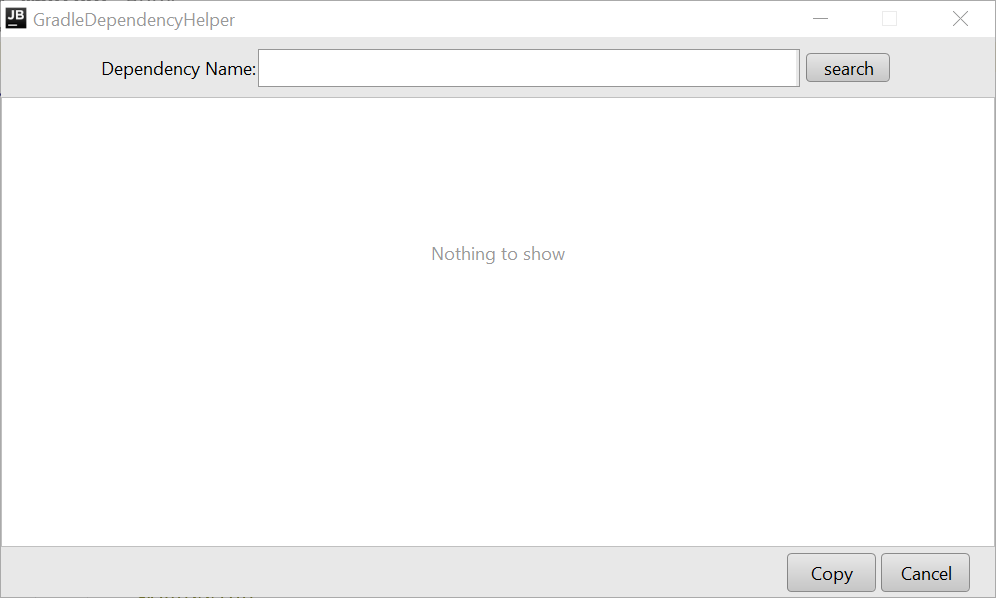
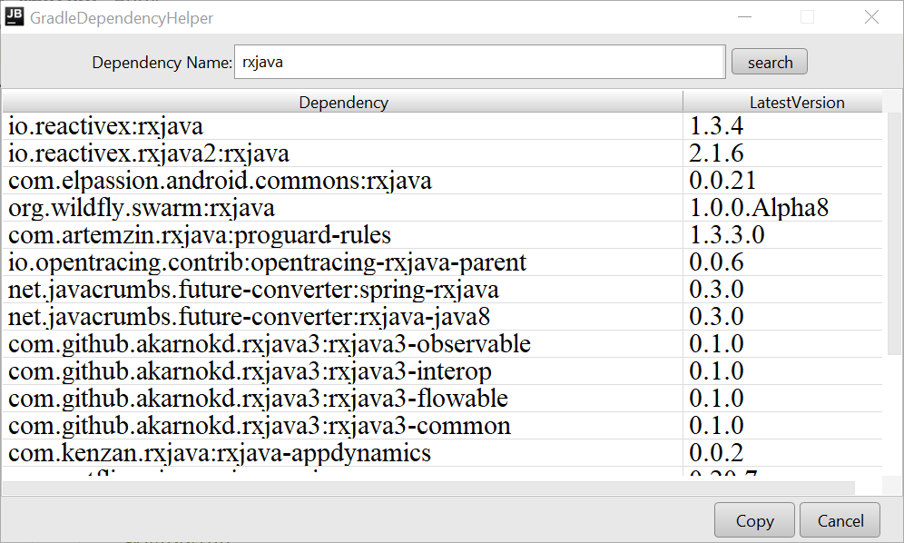
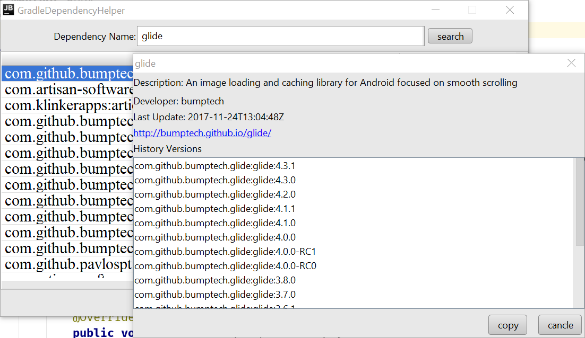
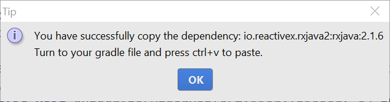

# GradleDependencyHelper
An Android Studio Plugin for searching maven dependencies faster.

### Description
GradleDependencyHelper is an Android Studio Plugin for searching dependencies faster.Finish importing your gradle dependency with this plugin instead of opening the web browser.

### Usage
Install the plugin,find out the plugin named GDependency in the ToolsMenu or press ctrl+alt+V to open the plugin window.

  

It should be like this.

  

Type the dependency you want to search,then press ENTER or search button.

  

Select the dependency you need,press the copy button to copy the latest version or just double click the dependency to see the details and history versions.

  

  

Finally go to your gradle file and press ctrl+v to paste it.

[Download plugin](plugin/GradleDependencyHelper.zip)
Download the dependency file and install it in the setting menu.

## Notice
    1.The plugin uses fastjson to parse json data.
    2.Be sure you are connected to network,or nothing will be displayed.

# License
      Copyright 2017 AbbyJM

      Licensed under the Apache License, Version 2.0 (the "License");
      you may not use this file except in compliance with the License.
      You may obtain a copy of the License at

        http://www.apache.org/licenses/LICENSE-2.0

      Unless required by applicable law or agreed to in writing, software
      distributed under the License is distributed on an "AS IS" BASIS,
      WITHOUT WARRANTIES OR CONDITIONS OF ANY KIND, either express or implied.
      See the License for the specific language governing permissions and
      limitations under the License.
